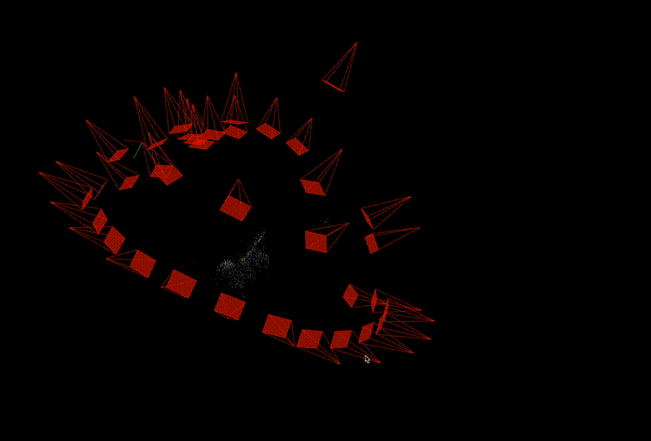
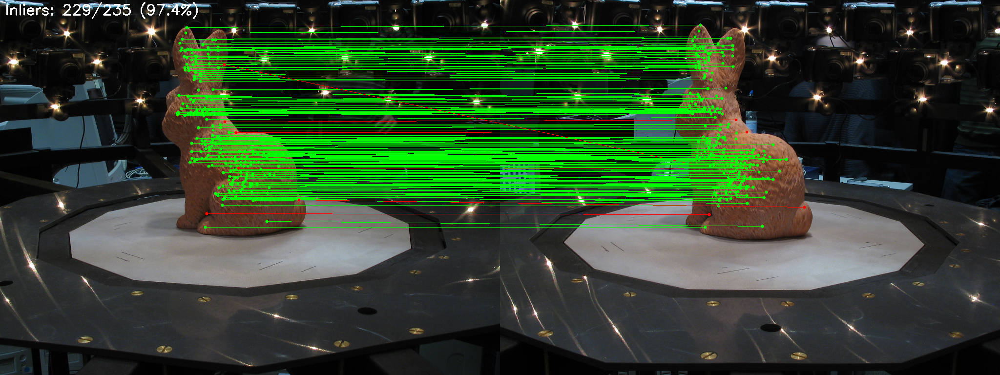
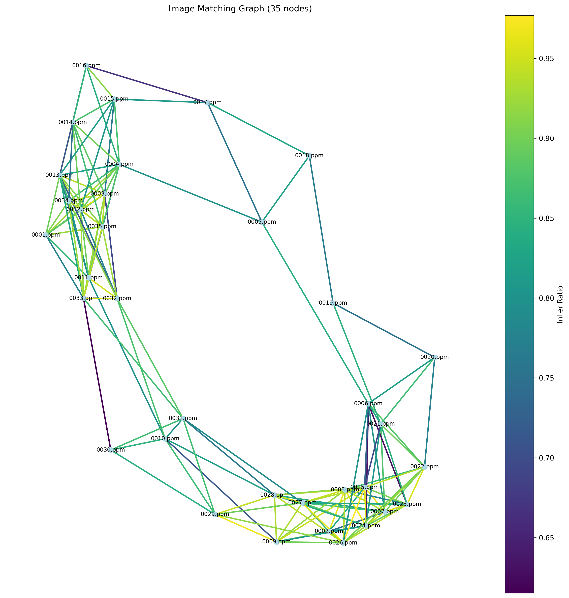

# Structure from Motion Pipeline

A robust Structure from Motion (SfM) implementation for 3D reconstruction from image sequences.

<p align="center">
  
</p>

## Table of Contents

- [Features](#features)
- [Installation](#installation)
- [Usage](#usage)
- [Project Structure](#project-structure)
- [Performance Tips](#performance-tips)
- [License](#license)

## Features

* SIFT feature detection and matching
* Incremental reconstruction with intelligent image ordering
* Graph-based image selection
* Export to COLMAP and PLY formats

## Installation

### Prerequisites

```bash
# Python version
Python 3.7

# Required packages
pip install -r requirements.txt
```

## Usage

The pipeline can be run in three modes:

### 1. Preprocessing Only

```bash
python main.py preprocess \
    --data_dir ./bunny_data \
    --start_idx 0 \
    --end_idx 35 \
    --min_matches 150
```

### 2. Reconstruction Only

```bash
python main.py reconstruct \
    --data_dir ./bunny_data \
    --output_dir ./bunny_data \
    --num_images 36 \
    --export_colmap
```

### 3. Full Pipeline

```bash
python main.py pipeline \
    --data_dir ./bunny_data \
    --output_dir ./bunny_data \
    --start_idx 0 \
    --end_idx 35 \
    --num_images 36
```

## Command Line Arguments

### Global Arguments
* `--log_level`: Logging level (DEBUG/INFO/WARNING/ERROR)

### Preprocessing Arguments
* `--data_dir`: Input data directory
* `--start_idx`: Starting image index (0-999)
* `--end_idx`: Ending image index (0-999)
* `--min_matches`: Minimum feature matches (20-1000)
* `--visualize`: Show visualizations
* `--mask`: Path to mask image

### Reconstruction Arguments
* `--data_dir`: Preprocessed data directory
* `--output_dir`: Output directory
* `--num_images`: Number of images (2-1000)
* `--export_colmap`: Export to COLMAP format
* `--export_meshlab`: Export to MeshLab format

## Project Structure

```
sfm/
├── main.py                # Main entry point
├── utils/
│   ├── image_matcher.py   # Feature matching
│   └── image_selector.py  # Graph-based selection
│   └── sfm_reconstruction.py  # Core SfM pipeline
│   └── export.py             # Export utilities
```

## Implementation Details

### Feature Matching
* SIFT features with ratio test
* Mutual nearest neighbor matching
* Geometric verification
* Match filtering

<p align="center">
  
  <br>
  <em>Feature Matching between Images 7 and 24</em>
</p>

### Reconstruction
* Initial pair selection based on:
  * Number of matches
  * Inlier ratio
  * Baseline length
  * Feature distribution

<p align="center">
  
  <br>
  <em>Graph Network for next best image selection</em>
</p>

### Output Structure

```
output_dir/
├── reconstruction/
│   ├── poses.json        # Camera poses
│   └── points3D.json     # 3D points
└── exports/
    ├── colmap/          # COLMAP format
    └── reconstruction.ply # Point cloud
```

## Performance Tips

### Memory Usage
* Use appropriate batch sizes
* Enable point filtering
* Adjust feature parameters

### Speed Optimization
* Use GPU acceleration
* Adjust bundle adjustment frequency
* Tune RANSAC parameters

### Quality Improvement
* Ensure image overlap
* Use high-quality images
* Adjust thresholds

## License

Apache License. See [LICENSE](LICENSE) file.

---

For issues and feature requests, use the [GitHub issue tracker](https://github.com/yourusername/sfm/issues).